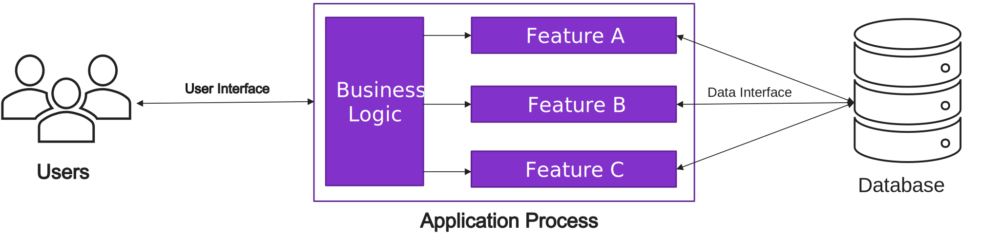
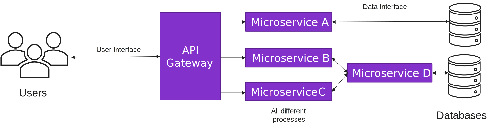
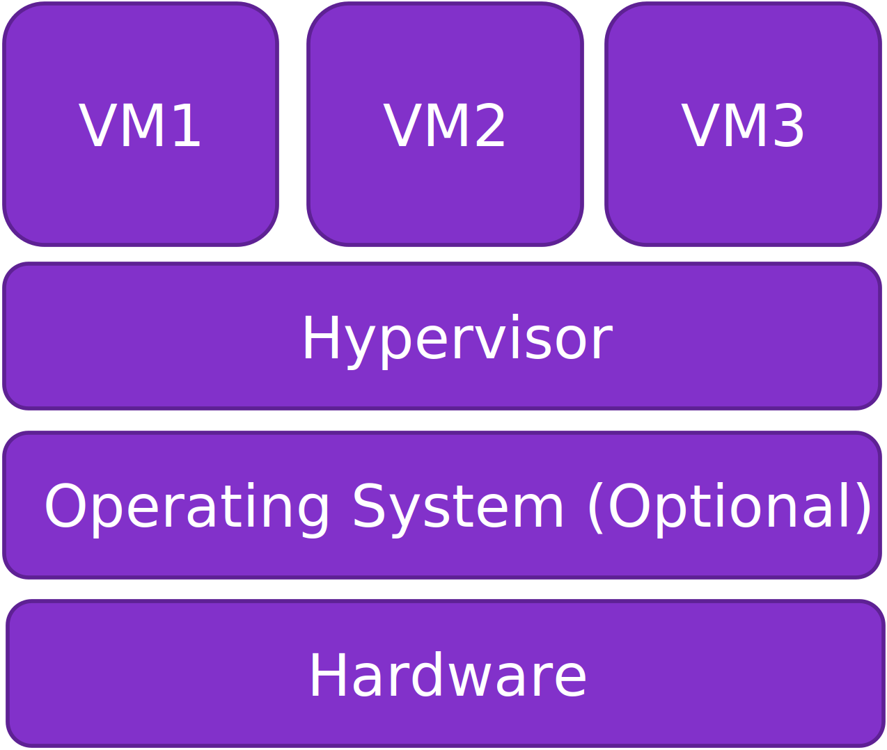
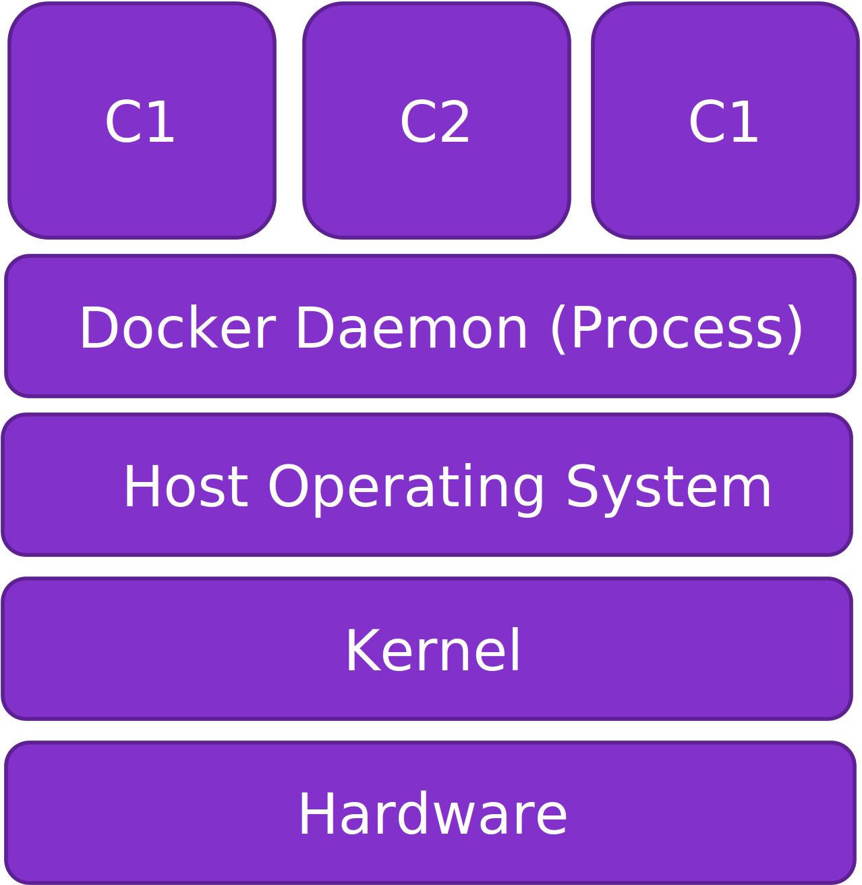

# Jamhacks 6 - Intro to Docker

## A Shift in the Industry

Before we actually start talking about Docker, I'm going to start off with a bit of history how applications are designed.

### Monolithic Applications

For many years the most popular way of designing an application is as a monolith. For the most part, what this meant is that the whole application would just run as a single process. Consider a social media app with some features, for example you could post, message others, and can browse a marketplace. Under the monolithic model, all of these would be running as part of the same process, similar to this:
<center>  </center>

Monolithic apps really caught on because of their simplicity. They are really easy to reason about and deploy. The fact that it's all in a single process makes it much easier to visualize and trace how data flows in the application. In addition, many applications ended up as a single file, like a Java `.jar` or some other kind of executable. This means that running the application was just a matter of executing the file that contains the code for it. 

This sounds really great, especially for small apps. As the application grows though problems start to crop up. First of all, start up time is really affect by such a large application. This has been known in larger companies to be issues after servers have gone down that getting them running again. Performance is also impacted by monolithic applications at times, such as investigated in this [paper](https://www.researchgate.net/publication/327918047_Performance_Analysis_of_Monolithic_and_Micro_Service_Architectures_-_Containers_Technology_Proceedings_of_the_7th_International_Conference_on_Software_Process_Improvement_CIMPS_2018). There are other issues related to development later on. Because the application is a single executable, every time there is a change the whole executable has to be rebuilt and redeployed. There are of course ways to cache some results in the build step, but redeploying the app can be slow as discussed before. A final issue I want to talk about is code coupling. It is easy to design a monolithic application that where the features and systems are tightly coupled together. This is because of the "single process" nature of the application. This leads to making it much harder to make changes as a single change might affect very many features in the app, as all rely on this one feature to work in a particular way. There are ways around this though with good design! I found this [article](https://codeopinion.com/loosely-coupled-monolith/) an interesting read.

### Microservices
Over the last decade or so, another way of designing an application emerged: Microservices. Although it was talked about an demoed before, the big push for these designs started with Docker's launch in 2013. The idea behind microservices is to split the application into smaller features, each being a process. These processes then communicate with each other to perform the same functionality as the traditional monolithic app. An example of a microservice application is:
<center>  </center>
This model really tries to solve some issues with the monolithic design. The first one is deployment. The microservices are very light weight, so launching one is much quicker. This is especially true when a service goes down. Instead of the whole app needing to start up, a single service just needs to start. In particular, this is useful if a service fails and needs to restart. Instead of needing to restart the whole app it will only need to relaunch the single service.

Making changes too and deploying is less intrusive on currently running services. You only really need to deploy the services that you make changes to. In addition, the separation promotes more decoupled code from the get-go.

The biggest issue with Microservices though is the complexity of the design. The way that everything interacts might be very intricate. You need to spend much more time when actually designing and implementing the services.

## Virtualization
So how does Docker help with implementing microservices? The basic answer: It manages the computer's resources for the services. What it does is called "Virtualization", basically abstracting away the hardware of the computer and managing the resources like Memory and CPU time for the processes.

Virtualization was introduced many years ago with virtual machines (VMs). The idea behind a VM is use software to manage the hardware resources for a computer, again with the purpose of abstracting it away. This software is called a Hypervisor. Having a hypervisor could allow you to run several operating systems, each thinking it's just interacting with the hardware directly, but in reality everything is being rerouted through the hypervisor. A virtual machine setup could look something like this:
<center>  </center>
There are two types of hypervisors, Type 1 do not have an operating system between it and the Hardware, while Type 2 hypervisors do. If you've ever used a hypervisor on your own computer, such as VMware workstation, you probably used a Type 2. Type 1 hypervisors are used most commonly on servers.

It does seem like we can run microservices as I described above using this setup and we technically could. We can have each service inside its own VM and set up a way for them to interact. There is an inefficiency here though; Each VM must have a all the files for an operating system. There is a lot of redundancy as many of these files will be the exact same across all VMs.

This is a big change that Docker did, they reduced the number of copies to files! The biggest difference for Docker is that the Kernel, basically a process doing the management of resources, is shared between all of the virtual instances. For terminology, Docker uses the word Container, which is analogous to a Virtual Machine for a hypervisors. Each container will have access to the same Kernel which is necessarily run on an existing OS, called the Host OS. The setup looks like this:
<center>  </center>
A process called the Docker Daemon will act analogous to the hypervisor, actually allocating resources to the containers by communicating with the Kernel. All of the containers run some sort of Linux operating system. Interestingly, to be able to run these containers on Windows or Mac OS, we actually need to run the Linux Host OS in a operating system itself! You can see these two technologies build on top of each other! 

There are two more benefits I want to talk about that comes around from virtualization. First of all, it is very easy to move around the files to actually launch containers and VMs. The point is, you can set up an environment for running and app inside of a VM or container and then send it to a different computer and it will behave the same way! (With some exceptions unfortunately though). This makes it so much easier for developing and deploying applications. The second ability is isolation. Since all resources are managed by software, the Daemon/Hypervisor, the software can manage what parts of the system that a container has access to (I will start just saying container from now on, this also applied to VMs though). This can mean a few things. First, the container will only have access to files that the Daemon allows it to see. This means that the container won't be able to necessarily browse the Host OS's files, or those in other containers (we can enable it though!). Another thing that isolation could provide is not being able to see the other processes, or even containers. Really as far as the container concerned, it is running straight on the hardware. It doesn't know about anything that Docker is doing behind the scenes. What we can set up though are Volumes for storing files and Networks for containers to communicate!

## Getting Started with Docker

### Getting Docker Installed
I won't be going through the actual installation process, but here are some links to how to do so:
- [Docker Desktop](https://docs.docker.com/get-docker/) for Mac/Windows/Linux
- [Debian Linux](https://docs.docker.com/engine/install/debian/) like Ubuntu
- [Fedora Linux](https://docs.docker.com/engine/install/fedora/)

In general you can probably search "[My OS] install docker" for steps how to do so.

### Running a Container
The features in Docker revolve around containers. What is a container though? The way I often thinking about it is as a lightweight virtual computer running on top of my physical computer. To this computer it feel like it is just a normal system, even though we know it's not.

A container is launched using an existing "Template" called an Image. An image is just the state we will be launching the container in. It knows the files that the container will know about by default and will likely have some command that it runs when the container is launched. This Image can be used to launch many containers, again it is just a template for how the container will start out as.

#### Launching our First Container
Let's get to actually launching a container!
Docker provides a great "Hello World" container that we can run to make sure docker is installed properly.
We can run `docker run hello-world`.

You might see something like:
```
Unable to find image 'hello-world:latest' locally
latest: Pulling from library/hello-world
7050e35b49f5: Pull complete 
Digest: sha256:80f31da1ac7b312ba29d65080fddf797dd76acfb870e677f390d5acba9741b17
Status: Downloaded newer image for hello-world:latest
```

What's happening is that Docker is looking for the image `hello-world`. Assuming we have a new installation of Docker, such an image doesn't exist. It will then try to look for such an image in some repository, in this case DockerHub. It downloads the files for the image and then runs a container from that image. Another way to download an image is using `docker pull`, which we'll see later.

We will be using `docker run` quite a bit today and trying out various configurations with it.

We will quickly check out two more commands, `docker ps` and `docker images`.
First, let's run `docker images`. What this will do is print out what images you have on your system. Doing so now may look something like this:
```
REPOSITORY    TAG       IMAGE ID       CREATED        SIZE
hello-world   latest    46331d942d63   2 months ago   9.14kB
```
We can see that we currently have the `hello-world` image downloaded. Remember how we saw the `Unable to find image 'hello-world:latest' locally` message before? Well now if we run `docker run hello-world` it will see that we have that an image called that already and launch that one. Something we will come back to soon is tags. They essentially allow you to have different versions of an image.

Let's take a look at `docker ps` now. It will display the current containers that you have. Let's run it now.
Just running `docker ps` right now might look pretty empty:
```
CONTAINER ID   IMAGE     COMMAND   CREATED   STATUS    PORTS     NAMES
```
This is because we don't actually have any active containers. Whenever you run a container, once the main command finishes it will stop the container. We can see all containers by doing `docker ps -a`:
```
CONTAINER ID   IMAGE         COMMAND    CREATED         STATUS                     PORTS     NAMES
e3f4268e7026   hello-world   "/hello"   2 minutes ago   Exited (0) 2 minutes ago             friendly_davinci
9ca9ae659ea1   hello-world   "/hello"   2 minutes ago   Exited (0) 2 minutes ago             cool_napier
```

Your output might look something like this. You can see some of information about the containers. We can confirm why we didn't see these containers just from running `docker ps`, they have the `Exited` status.

We will be using some of this information from `docker ps` and `docker images` quite a bit.

Before moving on, let me quickly talk about `docker logs`. It will print out the output that the container has produced while it was active. We run `docker logs <id>` to see the logs for that container. Doing so on the containers we launched from `hello-world` should bring up the same message as before. The `<id>` for the command (and for commands going forward) can be either be the ID under `CONTAINER ID` or the name under `NAMES`. Also, the concrete IDs I will be using are the ones from the examples I provide. Use the ones that your containers launch with.

A note about the `CONTAINER ID`, you can specify just enough to distinguish the container from all others. In this case we can use `e` or `e3` or `e3f`, etc. as the ID for the first container.

#### Cleaning Up

Once we don't need a container and/or image, we can delete them. This makes it easier to navigate your containers and images, and can free up space that the files for the images are using.

To remove an image, we run `docker rmi <id...>`. We can specify a list of image IDs we want to delete. Note that we shouldn't be deleting images for containers that currently exist, although technically we can.

`docker rm <id...>` let's you delete a container. In a similar way to deleting images, we're not able to delete containers which are running. We will need to run `docker stop <id...>` (or if necessary `docker kill <id...>`) to stop the container. Luckily for us our containers have already exited. Let's then run:
```
docker rm e3 cool_napier
docker rmi hello-world
```

Then running `docker ps -a` and `docker images` will show you that they have indeed been deleted.


#### Image Tags
As I mentioned, Docker images can be "versioned" by specifying a tag for the image. You can specify a tag using `image_name:tag` wherever you would use an image. The default tag is `latest` if no tag is specified. 

Let's download two versions of the Python image:
```
docker pull python
docker pull python:alpine
```
If we now run `docker images` we'll see these two images show up:
```
REPOSITORY   TAG       IMAGE ID       CREATED      SIZE
python       alpine    4a53e5731019   2 days ago   47.1MB
python       latest    25429fbb4a39   2 days ago   866MB
```
You might be surprised to see such a big difference, one is 47MB while the other is almost 1GB! The difference is the distribution that the image is based on, the normal Python image runs on Ubuntu, while the other runs on Alpine. Other tags might tell you what architecture the image is built for. For example, some images might only run on amd64 but have a tag for an arm version. This is especially important when running on an arm CPU such as Apple M1.

We can create a new image from another using `docker tag <SOURCE_IMG> <DEST_IMG>`. Let's make a new image called `py` that is just the `python:alpine` image: `docker tag python:alpine py`

Now we can run `docker images` to see our new image:
```
REPOSITORY   TAG       IMAGE ID       CREATED      SIZE
py           latest    4a53e5731019   2 days ago   47.1MB
python       alpine    4a53e5731019   2 days ago   47.1MB
python       latest    25429fbb4a39   2 days ago   866MB
```
Notice that `py` and `python:alpine` have the same image ID. They actually refer to the same image, just two different names for it.

I slightly misled you when I said that using `docker rmi` with both IDs and names is the same. This is slightly inaccurate. Here we see that `py` and `python:alpine` is the same image. Using the ID will indeed remove both images. On the other hand, removing `py` or `python:alpine` will try to remove the reference ("untag") to the `4a` image, and only remove the image itself if it is the last name the refers to it.

#### More Running Options
##### Running Your own commands
When running a container we can configure how it runs. The first thing we will look at is the `-it` flags. Officially it will open a TTY and keep the container's Standard Open open even if you detach. The intuitive way I see it is a way of launching the container in "interactive mode".

 Next, we will look at is the command that runs the launch of the container. There are two types of ways that the entry command can be started, which we will discuss a bit later. What the python image does though by default is run the `python` command which launches the Python shell. We can change this by specifying the command after the image name. For example, we can run the shell by running `docker run -it python bash`. You can explore the container like a normal Ubuntu system.

##### Saving Changes You Make

We can modify some files here. Let's do something simple, just write a Hello World python script in a new folder:
```
mkdir app
echo 'print("Hello World!")' > app/hello.py
```
We can exit the container now, which will stop it.
Running `docker ps -a` will show the container ID. Docker can save the changes we made here and create a new image. This is done using `docker commit <CONTAINER ID> <IMAGE:TAG>`. As an example, we can commit the changes into an image called `py:app`: `docker commit <ID> py:app`. 

To test it, we now run `docker run py:app python3 /app/hello.py`

---
<!-- 
Before we continue, please download this repository if you haven't already. You will have a folder called "examples/rest_server". This is a simple REST API. Let's navigate to the examples directory. -->

##### Bind Mounts
Normally containers can't access files from the host. We will be looking at one way of sharing data with the host system: a bind mount. The idea is to map a directory from the host or file from the host OS into the container. To see this in action, let's make another small script on our computer.
```
echo 'print("Hello From Host!")' > hello.py
```
or write a file called `hello.py` with `print("Hello From Host!")`.

Now, there are technically two ways to make a bind mount, the traditional way and a more modernized approach. Today I will be showing the modern approach, but feel free to check out the [docs](https://docs.docker.com/storage/bind-mounts/) for how the traditional syntax looks like. I personally prefer the traditional approach because it is much shorter but the modern approach is preferred.

We specify a bind mount using the option `--mount type=bind,source=<SRC_PATH>,target=<DEST_PATH>`. The source path must be the absolute path on host OS. 

Let's check out the file we just made in a container. To do so, run:
```sh
docker run --mount type=bind,source=$(pwd)/hello.py,target=hello/main.py \
-it python bash
```
Looking at the `/hello` directory we see a file `main.py`. Importantly, this is the same file that we have on the Host OS. This means that changes we make in the container will appear on the Host OS. Let's have the script print another message:
```
echo 'print("Hello from Container!")' >> /hello/main.py
```

Now checking out the file outside the container, we'll see the changes we made.

Bind mounts can also be used with directories in basically the same way.

##### Detaching From a Container
When running a container, we may sometimes want the process to run in the background. There are a few ways to do that.

The first way is my using a shortcut when running inside of the container. Let's run our favourite container: `docker run -it python bash`. We can now press `Ctrl-p Ctrl-q` to detach from the container. I have found issues in VS code, but this is great in the terminal.

Another way of having a detached container is by starting it detached. This is specified using the `-d` flag. For example, `docker run -d python bash`. Although just running bash is useless by itself, but we can imagine we're running some useful command.

Once we have a detached container, we can attach back by using `docker attach <CONTAINER_ID>`.


##### Exposing a Port
Similar to files and other resources, containers don't automatically have access to network ports. I'm not going to cover network ports, hopefully you know about them, but if you need a refresher here is a good [article](https://www.techtarget.com/searchnetworking/definition/port) discussing them. 

Let's start using an example image that runs a simple rest server. The methods and endpoints can be found in `examples/README.md`. Let's pull the image: `docker pull kertox662/jamhacks6`. Note that this image is built for arm CPUs, you might need to pull a different tag. There is the `amd` tag. If you want, feel free to tag it to something else, like `docker tag kertox662/jamhacks6 jh6` to make it easier to run.

Now that we have the image, we can run it. We expose a port using the `-p HOST_PORT:CONTAINER_PORT`, for example `-p 1234:80` which maps port 1234 on the Host OS to port 80 inside of the container. Our application runs on port `8000`. Let's now launch our container:
```
docker run -d -p 8000:8000 jh6
```

Let's test the app in the container. I'll use `curl` and this works great on Mac and Linux. Windows users might want to try the `curl.py` script in the repository which takes arguments `<METHOD> <URL>`.

```
curl localhost:8000/jam
``` 

We should see:
```
{"data": ["strawberry", "blueberry", "raspberry", "grape"]}
```

### Writing and Using a Dockerfile
We ran a few containers from images, but how were those images made? In many cases, the answer is a Dockerfile. A Dockerfile describes the steps to take for building an image. We can use `docker build` to execute those steps.

A Dockerfile usually looks something like (in meaning):
```
1. Use some kind of existing image as a starting point.
2. Copy some files, run some command, change directory, etc.
...
3. When launching the container, run this command
```

I will cover 8 total Dockerfile instruction:
- `FROM`
- `COPY/ADD`
- `RUN`
- `ENV`
- `WORKDIR`
- `CMD/ENTRYPOINT`

A full reference can be found in the [docs](https://docs.docker.com/engine/reference/builder/).

In this repository there is the `rest_server` directory containing a REST API made in Flask (Python). We will build an image that will run this server. Please navigate to the `examples` folder.

#### FROM

Let's start with the `FROM` instruction. It specifies the base image we will be building from, step 1 in the intuitive format above. Since we have a python server, it makes starts with an image that has python installed. We looked at two images, one running on Ubuntu and one on Alpine. Here we really don't care which OS we're running from. Let's choose the smaller Alpine image.

In a file called `Dockerfile` let's start with:
```docker
FROM python:alpine
```
We can now build this image by running `docker build .`, the dot specifying we want to do it in the current directory. Running `docker images`, we might see an entry like:
```
REPOSITORY   TAG       IMAGE ID       CREATED        SIZE
<none>       <none>    48c3dfc7d26d   3 days ago     47.1MB
```
We built an image, but we didn't give it a name. We can tag it now or specify a tag to `docker build` by running: `docker build . --tag myapp`

We will now see:
```docker
REPOSITORY   TAG       IMAGE ID       CREATED        SIZE
myapp        latest    48c3dfc7d26d   3 days ago     47.1MB
```
We can run this like any other image, this will be mostly similar to running the base `python:alpine` image.

Next we will look to copy our python files so that the container launches with them present. Both the `COPY` and `ADD` instructions accomplish this. The difference between them is that `ADD` has the same functionality as `COPY` but with some extra features. For example it can automatically decompress archives like zips, or will fetch files from a URL. `COPY` just takes files and directly copies them to the image and if that's all you need then that is the preferred instruction. Let's copy the entire folder to `/app` in the container.

#### COPY and ADD

`COPY` works like `COPY SRC DEST`, in our case `COPY rest_server /app`

The Dockerfile looks like:
```docker
FROM python:alpine
COPY rest_server /app
```
Let's rebuild and run the container with `docker run -it myapp sh`. When we look at the `/app` directory we will see all of the files. We can try to run the app with `python app/main.py` but we will get an error:

```python
ModuleNotFoundError: No module named 'flask'
```
We need to use `pip` to install all of the dependencies. The dependency needed is `flask_restful` so we can just do `pip install flask_restful`, but I have also provided a `requirements.txt` with it there, using `pip install -r requirements.txt`.

We technically could install the package every single time we run a container from the image, but it would be easier to have the image already had everything installed. This is an opportunity for the `RUN` instruction! 

#### RUN

`RUN` just executes some shell command. By default it will do so from the root directory. In the Dockerfile it will look like `RUN COMMAND...`. For us we want either `RUN pip install flask_restful` or `RUN pip install -r app/requirements.txt`. In order to make it easier to modify the dependencies let's make it the second one.

The Dockerfile will now look like:
```docker
FROM python:alpine
COPY rest_server /app
RUN  pip install -r app/requirements.txt
```

#### WORKDIR
`WORKDIR` changes the working directory. When copying by files or running commands the default is to do some from the top most, root, directory. This will change where it will start from. For example, we can change it to our app directory. This can be done using just `WORKDIR /app`. Let's put it in before our `RUN` instruction.

Remember that we specified the path for the requirements file from the root. Since we are now in the `app` directory we can drop the `app/`. In fact the way it is now does not work since the `app` directory does not have an `app` directory of its own! So we in fact need to do the change.

The Dockerfile will now look like:
```docker
FROM python:alpine
COPY rest_server /app
WORKDIR /app
RUN  pip install -r requirements.txt
```

#### ENV
I'll quickly go over `ENV`, we do not need it in our Dockerfile but it may be useful. `ENV` just sets an environment variable in the container. The format is `ENV KEY=VALUE`, for example `ENV APP_NAME=/app/main.py`.

#### CMD and ENTRYPOINT
We finally get to the last instructions we will look at for Dockerfiles. The point of these instructions is to specify what to run when the container is launched. They do so in slightly different ways though. Both are specified like `CMD COMMAND...` or `CMD ["cmd1", "arg1", ...]`

`CMD` specifies the default command to run when the container launches. This can be overridden when running the container just by putting your command we want after the image name. This is what we did with the Python image!

`ENTRYPOINT` specifies the command that we run and cannot be changed. We can give more arguments when running the container, but these won't change the command. Instead, the arguments that we give will be passed as arguments to the command. As an example, say we have an entrypoint `ENTRYPOINT ["python", "main.py"]` and we run `docker run myapp python app.py` the container will actually run the following command at launch: `python main.py python app.py` where `python` and `app.py` are arguments to `main.py`.

For this we don't really care which one we want to use. Either one will work for our simple behaviour. The server does have the option to take in a different database so we might want to use `ENTRYPOINT` for that. I will be choosing `CMD` though. So we will add `CMD ["python", "main.py"]`. Note we use `main.py` and not `app/main.py` since our work directory is already `/app`. Also the command format can vary, we could use `CMD python main.py` instead.

Our final Dockerfile will look like:
```docker
FROM python:alpine
COPY rest_server /app
WORKDIR /app
RUN  pip install -r requirements.txt
CMD ["python", "main.py"]
```

### Next Steps
We've taken a look at some Docker basics, but where do we go from here. The first thing is to look into something I mentioned a while ago, Networks and Volumes. They are additional features provided by Docker itself and helpful for running containers. Something else is to look at some other commands for docker itself and other instructions for Dockerfiles.

A great step after is Docker Compose. It is a tool to help you coordinate Docker containers. I talked about how Docker really helped microservices become popular. It is tools like Docker Compose that help you manage the services container that house the microservices. It is a great way to start orchestrating containers.

After even that there is a more sophisticated tool called Kubernetes. Similar to Docker Compose, the goal is orchestrate container, but in a more robust way. At the moment it is the industry standard for coordinating containers.

### A Few Takeaways
To wrap up, there are some things that I hope you take away from this.

First, I don't expect you to remember all of the material I covered here right off the bat, I know I didn't. The goal of this document was not to make you a Docker expert just by reading it over once. Instead, my goal was to expose you to some things that Docker is capable of. I see knowing Docker's features as "I know there's a way to do this one thing" and "Here's how I do this one thing". I hope that you will partly remember the first, which will help you with the second. My main point, it's okay to not remember everything, if you know about something you can easily look online for how to use it and learn about it again.

Second, I believe the best way to cement your knowledge is to practice with it. I've given you many examples in this documents on how to run containers. Try using them and modifying them to your own needs. Hopefully this practice with the commands will help ingrain it in muscle memory.

Finally, you need to be prepared that you might be frustrated. Working with Docker is not the most intuitive, especially if you go for the microservice approach. It often leads to a different way of thinking. It is very important to stay patient and keep trying. The fact is, learning is hard. Trying to use something new that you haven't used before may be prove really tricky, but that's alright. Once you accept that it's normal to struggle with new ideas it will be easier to see what steps you need to take to help you learn.

Hopefully you feel like you've learned something new from me covering docker.
Happy Coding!
